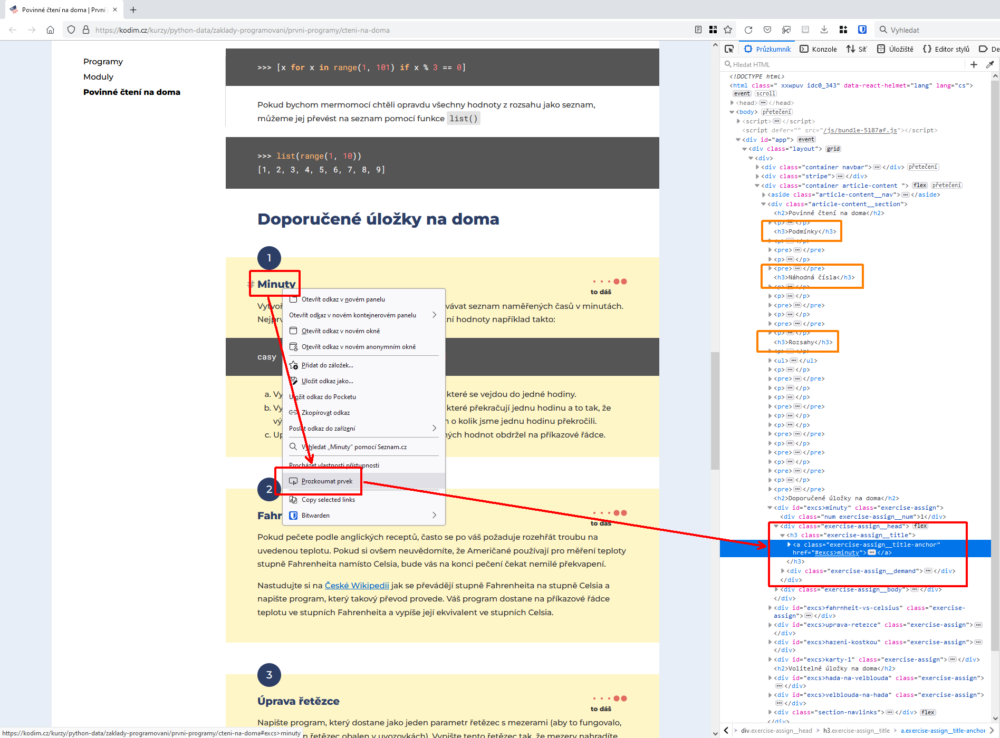

# Poznámky k lekci Python Data z 20. 10. (web scraping)

Ahoj,
omlouvám se, že to tak trvalo, ale konečně jsem se dostal k sepsání slíbených poznámek.

## Vzorové řešení [úlohy č. 2](https://kodim.cz/kurzy/python-data-1/ziskavani-dat/webscraping/webscraping#excs%3Escraping-kodim.cz) z kodim.cz

### Zadání

Napište program, který vypíše na výstup všechny povinné a nepovinné domácí úložky z lekce První programy spolu s jejich obtížností.

### Jdeme na to! 💪

Na stránce v dolní části vidím bloky s jednotlivými úlohami, v každém bloku název úlohy a její obtížnost. Jako první mě napadne, že si projdu jednotlivé bloky a v každém z nich pak najdu ty názvy a obtížnosti. Jenže mi hned dojde, že některé z vás jako začátečnice nepřijímají několikeré zanoření úplně dobře, takže na to půjdu jinak: získám všechny názvy a všechny obtížnosti, uložím je do dvou seznamů a pak je postupně společně vypíšu, což mi dá možnost ukázat vám několik způsobů propojení stejně dlouhých seznamů.

### Nalezení správných CSS selektorů

Klikám pravým tlačítkem na jeden z nadpisů a vyberu `Prozkoumat prvek`, `Inspect element` nebo podobně znějící volbu. Všimnu si, že ačkoli jsem kliknul na nadpis (`<h3>`), ve skutečnosti se dívám na vlastnosti v něm vnořeného odkazu (`<a>`). Taky si všimnu, že pokud budu chtít pracovat s nadpisem, musím si dát pozor na další nadpisy na stránce. Nadpis místo odkazu volím proto, že název jeho třídy je kratší. 😇 Můj vybraný selektor pro výběr nadpisů je tedy `h3.exercise-assign__title` (element H3 třídy exercise-assign__title). Obdobně postupuji pro získání selektoru pro obtížnost: `div.demand-text`.



### Vytvoření seznamů názvů úloh a obtížností

```py
from requests_html import HTMLSession  # importuji potřebný modul

session = HTMLSession()  # vytvářím nový objekt, pomocí kterého stránku stáhnu a zpracuju (parsuju)

print("## Úloha č. 2:")

# staženou a zpracovanou stránku uložím do proměnné stranka_2
stranka_2 = session.get("https://kodim.cz/kurzy/python-data/zaklady-programovani/prvni-programy/cteni-na-doma")  

nadpisy = []  # vytvořím si prázdný seznam pro všechny nadpisy
# projdu každý z nadpisů dané třídy, v rámci cyklu si ho uložím do proměnné `nadpis`…
for nadpis in stranka_2.html.find("h3.exercise-assign__title"):
    # …a text obsažený v tomto nadpisu připojím na konec seznamu `nadpisy`
    nadpisy.append(nadpis.text)

# opakuji předchozí 3 kroky pro obtížnosti
obtiznosti = []
for obtiznost in stranka_2.html.find("div.demand-text"):
    obtiznosti.append(obtiznost.text)
```

Nyní jsem tedy získal 2 seznamy – `nadpisy`:
```py
["Minuty", "Fahrnheit vs. Celsius", …]
```
a `obtiznosti`:
```py
["to dáš", "to dáš", …]
```

### Propojení obou seznamů

Propojení obou seznamů se dá udělat mnoha způsoby, a tak jsme si jich rovnou ukázali několik. Pořadí jsem zvolil od (podle mě) nejpochopitelnějšího až po nejpokročilejší. Prostudujte si ale všechny, každý z nich vám dá něco navíc. 🌈 🦄

#### Pomocí funkce range 🎯

První způsob, který byste určitě vymyslely i samy, protože už jste se s funkcí `range` setkaly.

```py
for n in range(0, len(nadpisy)):  # pro každé `n` v rozsahu od 0 (včetně) do počtu prvků v seznamu `nadpisy` (vyjma)
    print(f"{nadpisy[j]} 👉 {obtiznosti[j]}")  # vypiš prvek na příslušné pozici v seznamech `nadpisy` a `obtiznosti`
```

#### Pomocí čítače poprvé 🧮

Ukážeme si ale i další způsoby. Můžeme použít třeba cyklus `while`, který se provádí, dokud je splněna podmínka v něm uvedená.

```py
j = 0  # pomocná proměnná, kterou si inicializujeme na 0, což je pozice prvního prvku v obou seznamech
while j < len(nadpisy):  # dokud je `j` menší než je délka seznamu `nadpisy`
    print(f"{nadpisy[j]} 👉 {obtiznosti[j]}")  # vypiš prvek na příslušné pozici v seznamech `nadpisy` a `obtiznosti`
    j += 1  # zvětši (inkrementuj) proměnnou `j` o 1
```

#### Pomocí čítače podruhé ♾️

Tento další způsob je hodně podobný předchozímu. Liší se v tom, že si ukážeme, jak udělat cyklus `while` nekonečný a jak ho pak nakonec přece jen ukončit. V tomto případě jsme tím jen rozepsali kód na více řádků, může se vám ale hodit vědět, že tato možnost existuje, například pokud chcete cyklus přerušovat při splnění různých podmínek na více místech kódu. Navíc se díky tomu seznámíte s klíčovým slovek `break`, které prakticky ve všech běžných programovacích jazycích slouží k přerušování cyklů (včetně cyklu `for`).

```py
j = 0  # pomocná proměnná, kterou si inicializujeme na 0
while True:  # následující blok prováděj, dokud platí podmínka `True`, tzn. dokud `True == True`, tzn. navždy
    if j > len(nadpisy) - 1:  # pokud je `j` větší než „délka seznamu mínus 1“ (všimněte si, že jsem podmínku oproti minulému příkladu převrátil)
        break  # přeruš cyklus `while`
    print(f"{nadpisy[j]} 👉 {obtiznosti[j]}")  # vypiš prvek na příslušné pozici v seznamech `nadpisy` a `obtiznosti`
    j += 1  # zvětši (inkrementuj) proměnnou `j` o 1
```

#### Pomocí zipu 🤐

Tak, a teď poslední způsob, který mě ve skutečnosti napadl jako první, protože je nejvíc „pythonic“ a nejvíc sexy. Použijeme interní metodu Pythonu nazvanou `[zip](https://docs.python.org/3/library/functions.html?highlight=zip#zip)`, která stejně jako obyčejné zdrhovadlo spojuje dva seznamy pěkně zoubek po zoubku, vždy dva odpovídající zoubky k sobě. 🙂 

```py
for nadpis, obtiznost in zip(nadpisy, obtiznosti):
    print(f"{nadpis} 👉 {obtiznost}")
```

Jak vidíte, v tomto případě nemusím řešit žádné indexy, jednoduše si prvky z prvního seznamu `nadpisy` uložím do proměnné `nadpis` a prvky ze seznamu `obtiznosti` do proměnné `obtiznost`. Metoda `zip` totiž vrací dvojice (trojice, čtveřice atd. podle toho, kolik seznamů jí předám, zkrátka datový typ `tuple`) a pomocí čárky si tyto dvojice rozbalím (v angličtině se pro tento úkon používá sloveso „unpack“) do proměnných, které si pojmenuji, jak sám chci.
